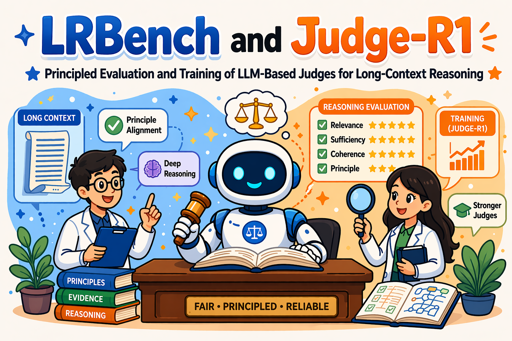

# Judge-R1

<div align="center">
  
</div>

Official repository for **LRBench and Judge-R1: Principled Evaluation and Training of LLM-Based Judges for Long-Context Reasoning** (Findings of ACL 2026).

Judge-R1 adapts the Search-R1 style agentic reinforcement learning pipeline to train LLM-based judges for long-context reasoning evaluation. The repository intentionally stays close to the reviewed `Search-R1-Qwen3` layout while adding Judge-R1-specific search, reward, and evaluation logic.

Paper: [ACL Anthology](https://aclanthology.org/2026.findings-acl.2029/)  
DOI: [10.18653/v1/2026.findings-acl.2029](https://doi.org/10.18653/v1/2026.findings-acl.2029)

For a more general agentic RL training framework, please refer to [Xinyi-0724/Search-R1-Qwen3](https://github.com/Xinyi-0724/Search-R1-Qwen3).

## Code and Data Availability

Sorry that the release of our code and data is delayed by approximately **8 weeks** due to an unexpected change of business priorities within Amazon.

In the meantime, if you have any questions or would like early access for research purposes, please contact **Xinyi Zhao (xyzhao24@uw.edu)**.

The LRBench dataset and LRBench data-construction code are not included in this repository yet. The current repository contains the Judge-R1 training and evaluation implementation, cleaned for public release.

## Overview

The paper contains two components:

- **LRBench**: a long-context benchmark for evaluating LLM-based judges across legal, medical, and academic-review reasoning tasks.
- **Judge-R1**: a reinforcement learning pipeline that trains a judge model to interleave reasoning with retrieval and produce principle-aware evaluations.

Judge-R1 trains models to compare two candidate reasoning traces and output:

```json
{
  "comparison": "A>B",
  "violated_principles": [1, 4],
  "explanation": "Reasoning B is less grounded in the provided evidence."
}
```

The six evaluated principles are:

1. Logical Correctness
2. Factual Consistency
3. Bias and Fairness
4. Groundedness
5. Helpfulness
6. Harmlessness

## How Judge-R1 Differs from Search-R1

**Different target task.** Search-R1 is optimized for open-domain QA, where the agent retrieves from a global web-scale corpus such as Wikipedia to produce a final answer. Judge-R1 is designed for pairwise judging: given two candidate reasonings `A` and `B`, the agent must retrieve evidence relevant to specific claims in the candidates and output a structured, principle-level diagnosis in addition to the preference. Search-R1 cannot be used as a direct off-the-shelf baseline for this task without significant modification to its input processing and reward structure.

**Different reward signal.** Judge-R1 explicitly supervises principle-level violation detection, such as macro-F1 over violated principles in Task 2, rather than only final-task success. This supervision enables the judge to return interpretable error attributions and is central to the paper's setting. It is a fundamental departure from the final-outcome reward design used in Search-R1.

**Case-specific retrieval instead of general knowledge retrieval.** Judge-R1 retrieval uses the context for the specific test case, not the training set and not a shared global index. Each case is treated as a self-contained corpus, such as a patient's specific medical history. We segment case contexts into sentence-consistent retrieval units and restrict retrieval by `case_id`, so during RL rollouts the agent can only retrieve from materials provided for that case.

These differences are reflected in the implementation:

- **Case-aware search loop**: generation stores `case_id` values from each batch and sends them with search requests.
- **Case-filtered dense retrieval**: the retriever filters dense search results to documents belonging to the same case/example when `case_id` is provided.
- **Judge reward function**: `search_r1_reasoning_judge` returns a detailed reward breakdown with `score`, `R1`, `R2`, `final_reward`, and `num_search`.
- **Judge-oriented training logs**: the trainer reports comparison reward, violated-principle F1 reward, final reward, and search usage during rollouts.

## Repository Structure

```text
.
├── README.md
├── LICENSE
├── Notice.txt
├── CITATION.cff
├── train_grpo.sh
├── train_ppo.sh
├── eval_grpo.sh
├── eval_ppo.sh
├── merge.sh
├── llm_agent/
├── search/
├── examples/
└── verl/
```

This structure is intentionally close to the reviewed reference repository layout.

## Installation

Judge-R1 uses two environments, matching the reference repository style.

### Training Environment

```bash
conda create -n judge-r1-verl python=3.10 -y
conda activate judge-r1-verl

pip install torch transformers datasets numpy scipy scikit-learn wandb
pip install vllm ray
export PYTHONPATH="$PWD:${PYTHONPATH:-}"
```

If your local VERL/vLLM installation requires a custom install sequence, follow the same environment setup used by the reviewed Search-R1-Qwen3 repository. Run all commands from the project root so the local `verl` package is importable.

### Retrieval Environment

```bash
conda create -n judge-r1-retriever python=3.10 -y
conda activate judge-r1-retriever

pip install torch transformers datasets fastapi uvicorn
conda install -c pytorch -c nvidia faiss-gpu=1.8.0
```

For CPU-only retrieval tests, install `faiss-cpu` and omit `--faiss_gpu`.

## Data Preparation

LRBench data is not included yet. With approved local access, prepare files in the same format expected by the VERL trainer:

```text
data/judge_r1/train.parquet
data/judge_r1/test.parquet
data/retrieval/judge_r1_corpus.jsonl
data/retrieval/judge_r1_index/e5_Flat.index
```

Each training/test example should include:

- a prompt containing the judge task
- ground-truth JSON with `comparison` and `violated_principles`
- `extra_info.case_id` or an equivalent non-tensor `case_id` field for case-aware retrieval

The retrieval corpus should contain a `case_id` field for each document when case-aware filtering is desired.

## Retrieval

Launch the local retriever:

```bash
conda activate judge-r1-retriever

python search/retrieval_server.py \
    --index_path data/retrieval/judge_r1_index/e5_Flat.index \
    --corpus_path data/retrieval/judge_r1_corpus.jsonl \
    --topk 3 \
    --retriever_name e5 \
    --retriever_model intfloat/e5-base-v2 \
    --faiss_gpu
```

The server exposes:

- `GET /health`
- `POST /retrieve`

`POST /retrieve` accepts an optional `case_id`; when provided, Judge-R1 filters results to the relevant case.

## Training

Run GRPO training:

```bash
DATA_DIR=data/judge_r1 \
BASE_MODEL=Qwen/Qwen3-8B \
EXPERIMENT_NAME=judge-r1-grpo-qwen3-8b \
bash train_grpo.sh
```

Run PPO training:

```bash
DATA_DIR=data/judge_r1 \
BASE_MODEL=Qwen/Qwen3-8B \
EXPERIMENT_NAME=judge-r1-ppo-qwen3-8b \
bash train_ppo.sh
```

Useful overrides:

```bash
N_GPUS=8
RETRIEVER_URL=http://127.0.0.1:8000/retrieve
WANDB_PROJECT=Judge-R1
TOTAL_TRAINING_STEPS=800
```

## Evaluation

Merge a checkpoint:

```bash
METHOD=grpo bash merge.sh
```

Evaluate:

```bash
DATA_DIR=data/judge_r1 \
BASE_MODEL=models/judge-r1-grpo-qwen3-8b \
EXPERIMENT_NAME=judge-r1-grpo-qwen3-8b-eval \
bash eval_grpo.sh
```

Predictions are written under `inference/` by default. Paper metric scripts tied to LRBench will be released with the LRBench code/data package once that release is approved.

## Expected Outputs

- `verl_checkpoints/<experiment>/`: FSDP training checkpoints
- `models/<experiment>/`: merged Hugging Face model
- `logs/`: training, evaluation, and retrieval logs
- `inference/*.jsonl`: prediction files
- optional W&B logs under the configured project

Generated data, checkpoints, logs, models, and prediction files are ignored by Git.

Suggested public model IDs, once checkpoints are approved for publication:

- `Xinyi-0724/Judge-R1-GRPO-Qwen3-8B`
- `Xinyi-0724/Judge-R1-PPO-Qwen3-8B`

## Reproducibility Checklist

1. Install the training and retrieval environments.
2. Prepare approved local data and retrieval files.
3. Launch the retrieval server with `python search/retrieval_server.py ...`.
4. Run `train_grpo.sh` or `train_ppo.sh`.
5. Merge the selected checkpoint with `merge.sh`.
6. Run `eval_grpo.sh` or `eval_ppo.sh`.
7. Inspect generated prediction JSONL files under `inference/`; compute paper metrics after the LRBench evaluation package is released.

## Citation

```bibtex
@inproceedings{zhao-etal-2026-lrbench,
    title = "{LRB}ench and Judge-R1: Principled Evaluation and Training of {LLM}-Based Judges for Long-Context Reasoning",
    author = "Zhao, Xinyi and Hu, Haoqi and Wang, Ziyu and Xiao, Jinfeng",
    booktitle = "Findings of the Association for Computational Linguistics: ACL 2026",
    month = jul,
    year = "2026",
    address = "San Diego, California, United States",
    publisher = "Association for Computational Linguistics",
    url = "https://aclanthology.org/2026.findings-acl.2029/",
    doi = "10.18653/v1/2026.findings-acl.2029",
    pages = "40839--40861"
}
```

## License

This repository follows the Apache-2.0 license inherited from the reviewed training framework. See [LICENSE](LICENSE) and [Notice.txt](Notice.txt).

## Acknowledgements

Judge-R1 builds on the Search-R1-style agentic RL training framework and the VERL ecosystem. We thank the open-source community for making reproducible research on tool-augmented LLM training possible.
